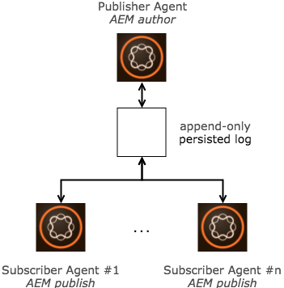
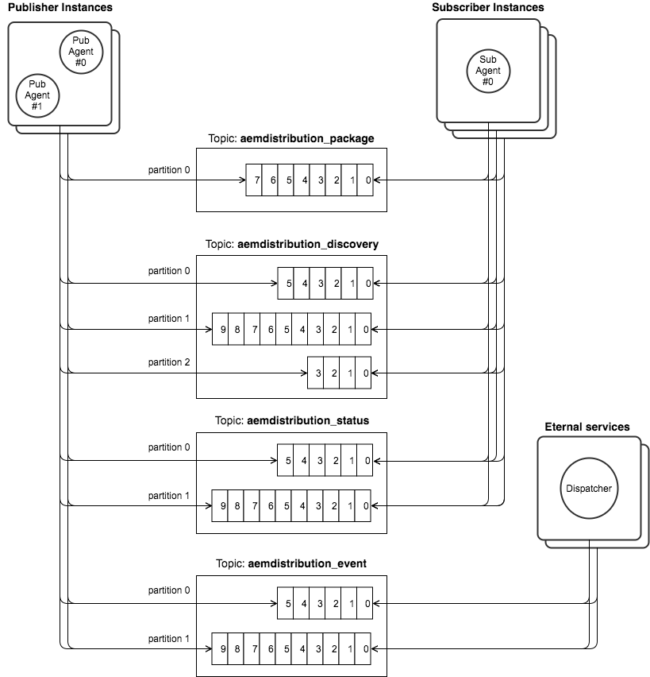
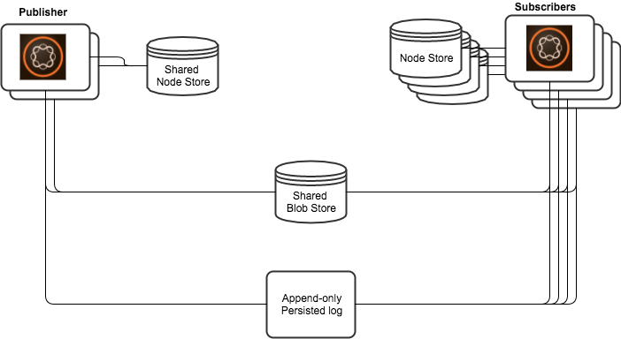
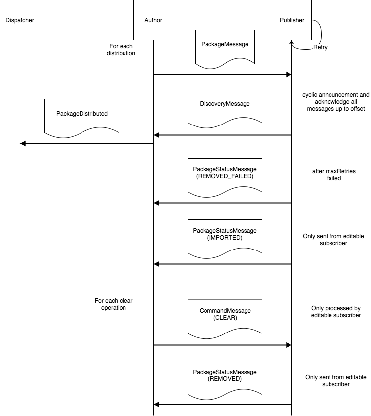

# Use case

This module provides a pair of Apache [Sling Content Distribution](https://sling.apache.org/documentation/bundles/content-distribution.html) (SCD) agents, a _Publisher_ agent and a _Subscriber_ agent.
The agents work together to support distribution of content across instances via a message journal (persisted log of messages).

# Design choices

The design must account for up to 100 _Subscriber_ agents per _Publisher_ agent and frequent scaling operations (addition/removal of _Subscriber_ agents). The size of content distributed is not limited.
The design avoids storing content on the instance running the _Publisher_ agents.
The design is based on the [event sourcing](https://martinfowler.com/eaaDev/EventSourcing.html) pattern in order to provide coordination-less scaling of the _Subscriber_ agents high throughput.

## Distribution model

The distribution model supported is the
Queueing distribution model which is the distribution model historically supported by SCD Forward agent.

The Queueing model requires the _Publisher_ agent to maintain a queue per _Subscriber_ agent.

The implementation simulates the _Subscriber_ queues efficiently based on a single copy of the _Publisher_ queue stored on the persisted log and the last processed offset published by each _Consumer_ agent.

## Handling of large assets

Publish/Subscribe services are designed to exchange small messages, smaller than 1MB by default for Apache Kafka. In contrast, SCD is designed to distribute arbitrarily large pice of content. This capacity mismatch is solved by leveraging a shared Apache Oak [Blob Store](https://jackrabbit.apache.org/oak/docs/plugins/blobstore.html) to transfer the large pieces of content.

The content is serialised into content packages using either Apache [Jackrabbit FileVault](https://jackrabbit.apache.org/filevault) in _binary-less_ mode. The binary-less mode produces content packages that contain references to large binaries (in the shared Blob store) rather than the binaries themselves.

The table below summarises the expected package size produced by FileVault or Durbo with binary-less mode enabled.

| Packaged Content | Binary less Package Size |
|:---------------- |:-------------------------|
|1 Asset           | 10 KB                    |
|1 Webpage         | 5 KB                     |
|Deep tree         | > 1MB                    |

The size of binary-less content packages produced for typical content (Web page or Asset) fits well in the Apache Kafka 1 MB message limit. However, deep trees (of Web pages and/or Assets) _may_ produce packages that exceed the Apache Kafka 1 MB limit.

In order to support deep tree distribution of any size, two solutions have been evaluated, _chunking binary-less content packages_ and _sharing binary-less content packages via the shared Blob store_. Each approach is summarised below.

We chose to implement the second option (sharing large content packages via the the shared Blob store), because it keeps a smaller storage footprint on the persisted log topic which helps reduce the Sling instance bandwidth (small packages to fetch) and also because implementing the shared Blob store cleanup could be done easily and reliably.

### Chunking large binary-less content packages

With this approach, large binary-less content packages are chunked into 1MB chunks. The chunks are sent and reassembled in the binary-less content package at destination. The pros and cons for this approach are summarised below.

<table align="center">
    <tr>
        <td><strong>Pros</strong></td>
        <td>
        P1. Binary-less packages are visible by the consumers directly when read 
        P2. Old packages are collected automatically by the persisted log retention mechanism
        </td>
    </tr>
    <tr>
        <td><strong>Cons</strong></td>
        <td>
        C1. The amount of data stored on the persisted log increases 
        C2. The code complexity is higher due to the chunking mechanism and handling of edge cases</td>
    </tr>
</table>

This approach could be viable only with the support for transactional commits, as supported by Apache [Kafka](https://kafka.apache.org) since version 0.11.0. Transactional commits simplify the chunking protocol by avoiding some tricky edge cases (e.g. chunks partially commit on the persisted log).
Not all the edge cases are avoided though (e.g. chunks partially retained after a collection cycle).

### Sharing large binary-less content packages via the shared Blob store

With this approach, large binary-less content packages are sent by reference in the Blob store, similarly to how FileVault or Durbo binary-less mode works. The pros and cons for this approach are summarised below.

<table align="center">
    <tr>
        <td><strong>Pros</strong></td>
        <td>
        P1. No edge case, the packages either are or are not in the queue 
        P2. The messages stored on the persisted log are small
        </td>
    </tr>
    <tr>
        <td><strong>Cons</strong></td>
        <td>
        C1. Binary-less packages may not be visible by the consumers directly but only after a few retries 
        C2. The old packages must be cleaned up from the shared Blob store together with the persisted log retention mechanism
        </td>
    </tr>
</table>

A cleanup algorithm has been implemented which removes the large packages that are no longer referenced by the persisted log package topic.

The algorithm is robust, simple and fits any topic retention policy configured (time and/or count based) without requiring a configuration in the Sling instance.

The cleanup algorithm runs periodically (every 12 hours by default) and does the following steps:

1. Get a repository session (without auto-refresh policy)
2. Get the current min and max offset on the persisted log
3. Iterate over all the large packages stored in the repository, remove the packages with an offset smaller than the current min offset, set the current max offset to the packages without offset.

## Publisher agent Queues

### Subscriber discovery

The Queueing model requires that a _Publisher_ agent maintains a queue for each subscribed _Subscriber_ agents. Maintaining the queue requires to inform the _Publisher_ agent about the identity and state of the _Subscriber_ agents.

Informing the _Publisher_ agent about the _Subscriber_ agents via configurations is impractical when supporting auto scaling of instances.
Thus a very simple discovery protocol is implemented.

The protocol consists of sending periodically, from each _Subscriber_ agent, a discovery message containing the last processed offset.
Based on those periodical messages, the _Publisher_ agent can compute the set of _Subscriber_ alive in the topology and compute the queue state for each of them.

### Computing package queues

Scaling up instances implies that the _Subscriber_ agents with arbitrarily old processed offset may come in the topology at any time.
Thus, at any time, the _Publisher_ agent queues should be able to serve entries as old as the entries available on the persisted log.

Iterating over the queues is an operation that is often invoked from customer code.
The operation is discouraged as it creates performances issues at least with the existing Sling Jobs / repository based implementation, but the customer code iterates often through the queues.

### Package queue caching

There are two basic ways to implement the package queue. Either by caching all the package metadata in memory, or by assigning a package consumer each time the queue must be computed.

We did implement a third approach, _on demand caching_ which combines the advantages and removes the cons of the two basic approaches.

Those approaches are detailed below.

#### Caching all packages metadata in memory

With this approach, the _Publisher_ agent would fetch all packages metadata in memory with a single persisted log consumer when starting up. The consumer would keep fetching the messages in memory as distribution packages are produced.

The queue would not store the entire messages, only the metadata required to implement the SCD Queue API. Per package entry, this would represent ~100 bytes to be kept in memory.

Since the persisted log queue is kept in memory, computing the queue for a given _Subscriber_ agent is a cheap operation. In particular, the implementation makes sure it is only a view of the memory which is returned and not duplicated in memory.

However, this approach has the drawback of not allowing to control the RAM usage efficiently. In particular, it would fetch mostly historical messages that may never be read.

This memory issue may be solved partially, by backing the queue on the instance File System. This would be a complex mechanism though.

#### Using a persisted log consumer per package queue

With this approach, the _Publisher_ agents use a persisted log consumer each time a queue must be built. This approach has the advantage of being very simple to implement and keep a constant and small memory footprint. However, it has the drawback of requiring a consumer per API call (potentially many) and to fetch data (lots of which are duplicates) over the network to build a queue.

### On demand caching

With this approach, we maintain two package consumers which store the package they read in a cache in memory. A head and tail consumers.

The tail consumer keeps reading the new packages at the tail of the queue. The head consumer is invoked on demand, in order to fetch the old packages.

This mechanism has multiple advantages, the queue are readily exposed when the agent start (potentially blocking on the head poller if needed), the minimum amount of messages are fetched from the package topic, queues can be computed quickly and efficiently from the cache.

In order to avoid an infinite cache growth, we implemented a cleanup task that reduce the cache memory usage.

### Error queue

When a _Subscriber_ agent is configured (maxRetries) to limit the number of attempts to import a package, an error queue per is automatically created on the _Publisher_ agent aside the _Subscriber_ agent queue.

The error queue keeps track of the packages that failed to be imported on the corresponding _Subscriber_ agent.

Unlike other error queues in SCD, this error queue does _not_ allow to retry a failed item. In a cloud deployment, an instance hitting failed items would be replaced. In case retrying a failed package is required, a new distribution request must be issued and will apply to all _Subscriber_ agents.

## Subscriber agent Queues

The implementation of the _Subscriber_ agent queue is a blocking queue that fetches a small (currently 8) batch of packages. Using a batch batch reduces the processing delay between two items (avoids the request delay) but keep the memory footprint small by not fetching the entire queue.

## Handling of blocked Queue

The queues sometimes get blocked, because a package can't be imported at destination. The root cause for a blocked queue can vary but generally is one of I. lack of authorisation, II. repository constraint violation.

For those cases, the queue must be unblocked. We expect customers to leverage error queues by default in a cloud deployments.

Manual queue editing is not supported because it could lead to inconsistent states between instances from the same farm.

## Management of persisted log consumer offsets

The consumer offsets for the _Subscriber_ agents are not managed by the persisted log, but by the agent code. The processed offsets are persisted in the repository (node store) together with the session that imports the package.

Storing the offset in the repository has two key properties

1. Given the package import and offset is atomic (done in the same session save operation), the packages are imported exactly once.
2. The offset is stored together with the data being imported. This implicitly transfers the processed offset when seeding a new instance with a cloned repository.

## Mapping of agent/topics/queues

A tenant may deploy one of more _Publisher_ agents, one or more _Subscriber_ agents. The distribution for each agents is done on the following persisted log topics (topic names configurable).
The messages are defined in the `org.apache.sling.distribution.journal.messages` module.

### aemdistribution&lowbar;package

| Feature | Description |
|:---------------- |:-------------------------|
|Messages|Protocol Buffers `DistributionPackage` message|
|Frequency| 1 message sent for each distribution action (independently of the number of _Subscriber_ agents)|
|Message size| < 10KB (typically), 800KB (maximum)|
|Nb partitions|Supports 1 partition only|
|Retention|The policy must allow each _Subscriber_ agents to import all packages (typically 7 days)|

### aemdistribution&lowbar;status

| Feature | Description |
|:---------------- |:-------------------------|
|Messages|Protocol Buffers `PackageStatusMessage` message|
|Frequency| 1 message sent for each FAILED package import or 1 message sent for each package import|
|Message size| < 100B (typically)|
|Nb partitions|Supports 1 partition only|
|Retention|The policy must be equivalent or keep messages longer than the _aemdistribution&lowbar;package_ topic policy (typically 7 days)|

### aemdistribution&lowbar;discovery

| Feature | Description |
|:---------------- |:-------------------------|
|Messages|Protocol Buffers `DiscoveryMessage` message|
|Frequency| 1 message sent periodically (~10 seconds) from each instance running _Subscriber_ agents|
|Message size| < 500B (typically) |
|Nb partitions|Supports _n_ partitions Partitions are assigned by using a hash of the _Subscriber_ agent name as key|
|Retention|The policy must allow to hold at least two discovery messages per agent (typically 1 hour) |

### aemdistribution&lowbar;command

| Feature | Description |
|:---------------- |:-------------------------|
|Messages|Protocol Buffers `CommandMessage` message|
|Frequency| 1 message sent per command|
|Message size| < 100B (typically)|
|Nb partitions|Supports _n_ partitions Partitions are assigned by using a hash of the _Subscriber_ agent name as key|
|Retention|The policy must be equivalent or keep messages longer than the _aemdistribution&lowbar;package_ topic policy (typically 7 days)|

### aemdistribution&lowbar;event

| Feature | Description |
|:---------------- |:-------------------------|
|Messages|JSON `PackageDistributedMessage` message|
|Frequency| 1 message sent when a package has been distributed|
|Message size| < 100B (typically) |
|Nb partitions|Supports _n_ partitions|
|Retention|The policy must be equivalent or keep messages longer than the _aemdistribution&lowbar;package_ topic policy (typically 7 days)|

# Deployment

## Requirements

1. The _Publisher_ and _Subscriber_ agents must share a blob store.
2. The persisted log must be reachable from all agents.

The typical deployment topology is shown below

## Supported persisted log implementations

This module exposes a messaging API and can run on any backend that implements the API. The messaging API can be implemented naturally on [Apache Kafka](https://kafka.apache.org) and could be easily supported by any RDB or document store with support for sequence such as [MongoDB](https://www.mongodb.com). The requirements to be supported by the persisted log are listed in the table below.

| Requirement | Description |
|:---------------- |:-------------------------|
|Persistence|Messages must be persisted and must be discardable according to a time based retention policy or explicitly|
|Ordering|Messages must be consumed in the same order for all observers. Messages must be associated to monotonically increasing offsets (managed by the persisted log) to decide their relative `happen-before` relation|
|Access|Messages must be streamable from a specified offset (random access), must be streamable from the oldest persisted offset, must be streamable from the next persisted offset, must support a Publish/Subscribe distribution model (decoupling of publishers and subscribers based on topics) allowing each subscribers to stream all messages potentially multiple times. The persisted log must support typically 1-10 publishers and 2-100 consumers per tenant.|
|Message size|The persisted log must support messages of size > 20KB, typically 1MB|

# Discrepancies with existing distribution implementation

| Aspect                       | SCD on Sling Jobs | SCD on persisted log |
|:---------------------------- |:-------------------------|:---------------------------|
|Distribution guarantee        | At least once            | At least once when in the persisted log topic retention policy limits |
|Repository write operations on _Publisher_ agent  | &#42; Binary-less Packages &#42; References (1 per publish) &#42; Sling Jobs (1 per publish)                     |&#42; Large binary-less packages |
|Support for package queues|&#42; Ordered, unordered &#42; Remove individual items &#42; Clear the queue|&#42; Ordered|
|Support for error queues|&#42; Optional &#42; Retries number configurable &#42; Tracks failed packages on author &#42; Explicit package retry per queue &#42; Remove individual items &#42; Clear the queue|&#42; Optional &#42; Retries number configurable &#42; Tracks failed packages on _Publisher_ agent|

# Internals

## Message Flows

For each distribute request on Author a PackageMessage (add or remove) is sent. All Publishers receive the messages and import at their own pace. If an import does not succeed then a number of retries are done. After the maxRetry count a PackageStatusMessage is sent to mark the import message failed. Editable Subscribers send a status message after importing a package successfully or after skipping a package as a result of applying a clear command.

In a certain time interval each Publisher sends a DiscoveryMessage. It announces the Publisher instance and acknowledges all messages until the offset of the last successful message. In case of retries it also transmits the retry count.

Clear commands can be sent to editable Subscribers individually. Clear commands clear all the packages remaining to be imported, up to the offset specified in the clear message.

For each clear command on Author a CommandMessage is sent with the max offset to be cleared. The CommandMessage is processed by the targeted Subscriber. The Subscriber send a removed status message for all packages that could be cleared.

## Data in repository

### Author

On author, the content packages are built using the user session.

In most cases, the content packages are small enough to fit in a single persisted log message and thus, no data is stored in the repository.

In some cases (typically when distributing very deep trees) it may happen that the content package does not fit in a single persisted log message. In those cases, and only in those cases, the instance running the Publisher agent (typically a Sling author instance) stores the content package as a binary property in the node store under the path

    /var/sling/distribution/journal/packages

The binary property is backed in the shared blob store. The binary property in the share blob store yields a reference that is shared in the content package.

### Publisher

On the publisher, the content packages are imported using a session associated to the service user mapped to the `org.apache.sling.distribution.journal` bundle.
By default, the service user is mapped to the `replication-service` service user.

On the publisher the distributed trees are imported into the repository and the offset of the last successful message is stored below the path

    /var/sling/distribution/journal/stores

### Resource Resolver session

The following table describes the resource resolver session used to perform each task of the implementation.

| Task                             | Session |
|:---------------------------------|:--------|
| Export content package           | The session provided via the `org.apache.sling.distribution.agent.spi.DistributionAgent#execute` interface.  |
| Import content package           | The service user session for the `importer` sub service.  |
| Manage offset stores and packages| The service user session for the `bookkeeper` sub service. |
